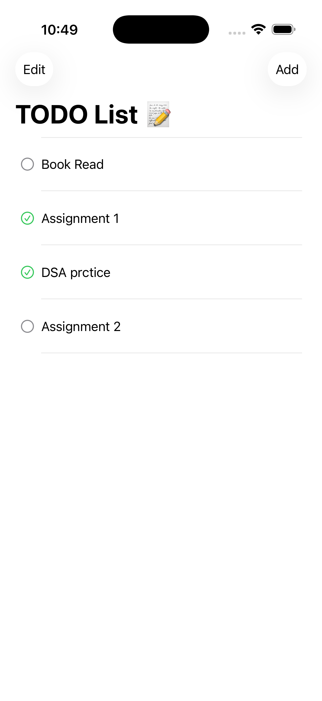
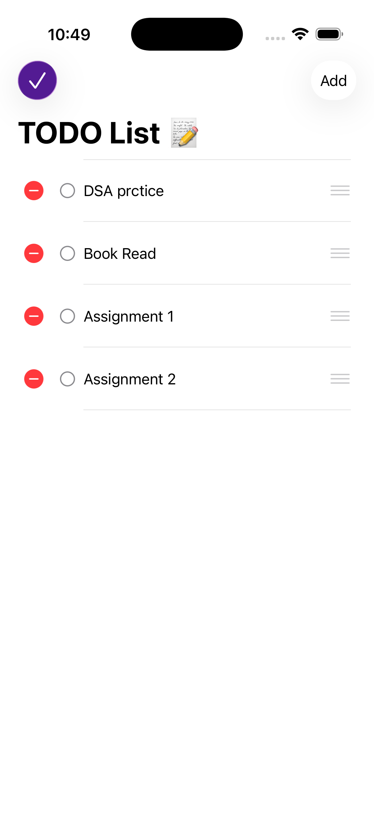

# 📝 Todo List App

A modern Todo List application built with **SwiftUI** following the **MVVM architecture pattern**.  
The app supports task creation, completion toggling, reordering, deletion, and persistent local storage using `UserDefaults`.

---

##  Features

- Add new tasks  
-  Mark tasks as completed  
-  Delete tasks  
-  Drag & reorder tasks  
-  Automatic local persistence  
-  Clean UI with smooth animations  
-  Built entirely with SwiftUI  

---

##  Architecture

This project follows the **Model–View–ViewModel (MVVM)** design pattern:

###  Model
`ItemModel`
- Conforms to `Identifiable` & `Codable`
- Stores task data
- Handles completion state updates

###  ViewModel
`ListViewModel`
- `ObservableObject`
- Uses `@Published` for reactive UI updates
- Manages business logic & persistence

###  Views
- `ListView` – Main task list
- `ListRowView` – Individual task row
- `AddView` – Add new task screen
- `NoItemsView` – Animated empty state

---

##  Persistence Layer

Data is stored locally using:

- `UserDefaults`
- `JSONEncoder`
- `JSONDecoder`

All changes are automatically saved when the task list updates.

---

##  Requirements

- iOS 16.0+
- Xcode 15+
- Swift 5.9+

---

##  Getting Started

1. Clone the repository
2. Open in Xcode
3. Build & Run on Simulator or Device

---

## 📱 App Screenshots

### Launch Screen

### Home Screen

### Add Todo

### Edit Todo

### Delete Todo

